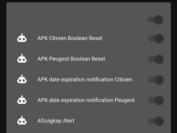

# Auto Filled Automations Card



### Requirements (HACS)
| Name | Type  | Description |
|----------------------------------|-------------|---------------------------------------------------------------------------------------------------------------------------------------------------------------------------------------------------------|
| [Auto Entities](https://github.com/thomasloven/lovelace-auto-entities) | Frontend | This card is needed to fill entities automatically |

### Resources
Add the following line to your lovelace resources
```/hacsfiles/lovelace-auto-entities/auto-entities.js```

### Configuration
- No configuration required 
- Experienced users can change the style and change include/exclude parameters if they wish (https://github.com/thomasloven/lovelace-auto-entities)

### Install
- Create a new file inside the folder of the view you want (e.g. /homekit-infused/user/views/automations/), you can name the file however you want (e.g. automation-card.yaml)
- Copy the code below and make changes if needed

```
- type: horizontal-stack
  cards:
    - !include ../../../base/includes/gap.yaml
    - type: custom:layout-card
      cards:
        - type: custom:auto-entities
          filter:
            include:
              - domain: automation
          sort:
            method: name
            numeric: true
          card:
            type: entities
            style: |
              ha-card {
                border-radius: {{ states('input_select.border_radius_selector') }};
                box-shadow: var(--box-shadow);
              }
    - !include ../../../base/includes/gap.yaml
```
