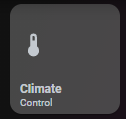

# Button (navigation)



### Description
This is the default HKI navigation button, it is by default used in the [menu](menu-card.md) but can also be used anywhere else like on the frontpage, [click here](frontpage-buttons.md) if you are looking for a predefined frontpage button row.

### Configuration
- You will need to set the name, icon, label and navigation path
- When using a layout-card you can also set a column size, else just use a horizontal-stack to stack buttons
- You can add a button badge if you like

### Advanced
| Parameters | Type | Default | Description |
|----------------------------------|-------------|----------------------------------|----------------------------------------------------------------------------------------------------------------------------------------------------------------------|
| name | String | none | Sets the name for the button |
| icon | String | none | Sets the icon for the button |
| label | String | none | Sets the label for the button |
| navigation_path | String | none | Sets the path the button should point to, you can ONLY choose any of the included views, to find out the path names you can open the `/homekit-infused/user/views/` folder. The folder names are exactly the same as their paths |
| notification | Template | none | Set a badge on a button, the badge will show what is set in the template, to make it easy all you'd need to do is replace the `input_number.empty` entity for an entity of which you want the state to be shown inside the badge (experienced users can set any template they want) |
| background_color | Template | none | Sets background color of the badge, to make it easy all you'd need to do is replace the `input_number.empty` with the exact same entity as you have put inside the notification parameter explained above |


### Install
- Create a new file inside the folder of the view you want (e.g. /homekit-infused/user/views/frontpage/), you can name the file however you want (e.g. buttons.yaml)
- Copy the code below and make changes if needed

```
- !include
  - '../../../base/templates/button/button-badge.yaml'
  - name: Lights
    label: Overview
    icon: mdi:floor-lamp
    navigation_path: /homekit-infused/lights
    notification: "[[[ if (states['input_number.empty'].state == 0) return '&nbsp'; else return `${states['input_number.empty'].state}`; ]]]"
    background_color: "[[[ if (states['input_number.empty'].state == 0) return 'rgba(0,0,0,0.0)'; else return 'var(--paper-item-icon-color)'; ]]]"   
```

### Extra Information
You can use different types of stacks (like horizontal or vertical) but you can also use layout card. In both examples The number of buttons on the same row is 3 (so there are 3 buttons placed horizontally this way)
```
# example with a vertical and horizontal stack
# I use a vertical-stack so that the next horizontal-stack is always together in place with the first horizontal-stack. This will make the buttons stick together even when the desktop browser decides to move the cards.
- type: vertical-stack
  cards:
    - type: horizontal-stack
      cards:
        - !include ../../../base/includes/gap.yaml
        - name: Lights
          label: Overview
          icon: mdi:floor-lamp
          navigation_path: /homekit-infused/lights
          notification: "[[[ if (states['input_number.empty'].state == 0) return '&nbsp'; else return `${states['input_number.empty'].state}`; ]]]"
          background_color: "[[[ if (states['input_number.empty'].state == 0) return 'rgba(0,0,0,0.0)'; else return 'var(--paper-item-icon-color)'; ]]]"  
        - name: Devices
          label: Overview
          icon: mdi:power-plug
          navigation_path: /homekit-infused/devices
          notification: "[[[ if (states['input_number.empty'].state == 0) return '&nbsp'; else return `${states['input_number.empty'].state}`; ]]]"
          background_color: "[[[ if (states['input_number.empty'].state == 0) return 'rgba(0,0,0,0.0)'; else return 'var(--paper-item-icon-color)'; ]]]" 
        - name: Security
          label: Overview
          icon: mdi:cctv
          navigation_path: /homekit-infused/security
          notification: "[[[ if (states['input_number.empty'].state == 0) return '&nbsp'; else return `${states['input_number.empty'].state}`; ]]]"
          background_color: "[[[ if (states['input_number.empty'].state == 0) return 'rgba(0,0,0,0.0)'; else return 'var(--paper-item-icon-color)'; ]]]"  
        - !include ../../../base/includes/gap.yaml
```
In the example above there are 3 buttons in the same horizontal-stack, if you want 4 buttons in the same stack you can add a single button in between.

There is however an easier way (since if you want 6 buttons, with each 3 in a row, you will need 2 horizontal-stacks). Instead we are going to use layout card now:
```
- type: horizontal-stack
  cards:
    - !include ../../../base/includes/gap.yaml
    - type: custom:layout-card
      column_num: 3
      justify_content: start
      layout: horizontal
      cards:
        - !include
          - '../../../base/templates/button/button-badge.yaml'
          - name: {{ _global.header.automations_title|default('Automations') }}
            label: {{ _global.header.automations_subtitle|default('Overview') }}
            icon: {{ _global.header.automations_icon|default('mdi:alpha-a-box') }}
            navigation_path: /homekit-infused/automations
            notification: "[[[ if (states['input_number.empty'].state == 0) return '&nbsp'; else return `${states['input_number.empty'].state}`; ]]]"
            background_color: "[[[ if (states['input_number.empty'].state == 0) return 'rgba(0,0,0,0.0)'; else return 'var(--paper-item-icon-color)'; ]]]"   
        - !include
          - '../../../base/templates/button/button-badge.yaml'
          - name: {{ _global.header.battery_title|default('Battery') }}
            label: {{ _global.header.battery_subtitle|default('Overview') }}
            icon: {{ _global.header.battery_icon|default('mdi:battery-50') }}
            navigation_path: /homekit-infused/battery
            notification: "[[[ if (states['input_number.empty'].state == 0) return '&nbsp'; else return `${states['input_number.empty'].state}`; ]]]"
            background_color: "[[[ if (states['input_number.empty'].state == 0) return 'rgba(0,0,0,0.0)'; else return 'var(--paper-item-icon-color)'; ]]]"  
        - !include
          - '../../../base/templates/button/button-badge.yaml'
          - name: {{ _global.header.calendar_title|default('Calendar') }}
            label: {{ _global.header.calendar_subtitle|default('Overview') }}
            icon: {{ _global.header.calendar_icon|default('mdi:calendar-account') }}
            navigation_path: /homekit-infused/calendar
            notification: "[[[ if (states['input_number.empty'].state == 0) return '&nbsp'; else return `${states['input_number.empty'].state}`; ]]]"
            background_color: "[[[ if (states['input_number.empty'].state == 0) return 'rgba(0,0,0,0.0)'; else return 'var(--paper-item-icon-color)'; ]]]"      
    - !include ../../../base/includes/gap.yaml
```
In this example we also have 3 buttons, but every button we add next will be on the next row (so if you'd add another 6 buttons with a total of 9 buttons, you will have 3 rows with columns of 3 buttons. Like a 3x3 grid)
This eliminates the need of using extra horizontal-stacks to achieve the same thing.

To control the placement, note that the cards within both a horizontal-stack and layout card will be rendered first from left to right, this can be endless in a horizontal-stack, and in a layout-card it will be the amount of columns you've set. (so if you set 3, the 4th card will be placed on a new line). So if you want certain buttons to be rendered first, you must put that button at the beginning of the stack.

*note: There is no 'better' way, they both achieve the same thing with the very difference of needing slightly less code for layout-card. However, layout-card is a custom-card whereas vertical/horizontal-stacks are core Home Assistant.
