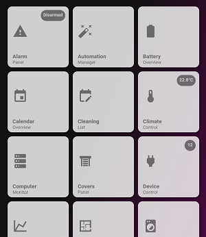

# Menu Card


### Description
This is the default HKI menu (in case you require this and deleted it by accident)

### Requirements (HACS)
| Name | Type  | Description |
|----------------------------------|-------------|---------------------------------------------------------------------------------------------------------------------------------------------------------------------------------------------------------|
| [NONE] | None | Not applicable |

### Configuration
- No configuration required

### Install
- Create a new file inside the folder of the view you want (e.g. /homekit-infused/user/views/menu/), you can name the file however you want (e.g. menu-card.yaml)
- Copy the code below and make changes if needed

### Advanced
- You can add a badge to the buttons, to do this all you need to do is change the following entity of a single button to something else `input_number.empty`. Changing this to for example `sensor.current_devices_on` will show you the state of all devices that are currently on (you must have setup device_counters.yaml for this to work). Each button has 3 of this `input_number.empty` entities and you need to change all 3 of them for the specific button.
- You can use any entity you want
- Experienced users can also add buttons (copy/paste an existing one and place it in between the other buttons). You MUST hardcode the names when using a custom button (or create an entry inside of /users/config/header.yaml)
- Experienced users can also change the template of the notification (note that name, icon and label will also accept JS templates!)

```
# lovelace_gen
- type: horizontal-stack
  cards:
    - !include ../../../base/includes/gap.yaml
    - type: custom:layout-card
      min_columns: 3
      max_columns: 3
      justify_content: start
      layout: horizontal
      cards:
        - !include
          - '../../../base/templates/button/default_with_badge.yaml'
          - name: {{ _global.header.automations_title|default('Automations') }}
            label: {{ _global.header.automations_subtitle|default('Overview') }}
            icon: {{ _global.header.automations_icon|default('mdi:alpha-a-box') }}
            navigation_path: /homekit-infused/automations
            notification: "[[[ if (states['input_number.empty'].state == 0) return '&nbsp'; else return `${states['input_number.empty'].state}`; ]]]"
            background_color: "[[[ if (states['input_number.empty'].state == 0) return 'rgba(0,0,0,0.0)'; else return 'var(--paper-item-icon-color)'; ]]]"   
        - !include
          - '../../../base/templates/button/default_with_badge.yaml'
          - name: {{ _global.header.battery_title|default('Battery') }}
            label: {{ _global.header.battery_subtitle|default('Overview') }}
            icon: {{ _global.header.battery_icon|default('mdi:battery-50') }}
            navigation_path: /homekit-infused/battery
            notification: "[[[ if (states['input_number.empty'].state == 0) return '&nbsp'; else return `${states['input_number.empty'].state}`; ]]]"
            background_color: "[[[ if (states['input_number.empty'].state == 0) return 'rgba(0,0,0,0.0)'; else return 'var(--paper-item-icon-color)'; ]]]"  
        - !include
          - '../../../base/templates/button/default_with_badge.yaml'
          - name: {{ _global.header.calendar_title|default('Calendar') }}
            label: {{ _global.header.calendar_subtitle|default('Overview') }}
            icon: {{ _global.header.calendar_icon|default('mdi:calendar-account') }}
            navigation_path: /homekit-infused/calendar
            notification: "[[[ if (states['input_number.empty'].state == 0) return '&nbsp'; else return `${states['input_number.empty'].state}`; ]]]"
            background_color: "[[[ if (states['input_number.empty'].state == 0) return 'rgba(0,0,0,0.0)'; else return 'var(--paper-item-icon-color)'; ]]]"  
        - !include
          - '../../../base/templates/button/default_with_badge.yaml'
          - name: {{ _global.header.certificates_title|default('Certificates') }}
            label: {{ _global.header.certificates_subtitle|default('Expiry') }}
            icon: {{ _global.header.certificates_icon|default('mdi:certificate') }}
            navigation_path: /homekit-infused/certificates
            notification: "[[[ if (states['input_number.empty'].state == 0) return '&nbsp'; else return `${states['input_number.empty'].state}`; ]]]"
            background_color: "[[[ if (states['input_number.empty'].state == 0) return 'rgba(0,0,0,0.0)'; else return 'var(--paper-item-icon-color)'; ]]]"    
        - !include
          - '../../../base/templates/button/default_with_badge.yaml'
          - name: {{ _global.header.cleaning_title|default('Cleaning') }}
            label: {{ _global.header.cleaning_subtitle|default('Overview') }}
            icon: {{ _global.header.cleaning_icon|default('mdi:washing-machine') }}
            navigation_path: /homekit-infused/cleaning
            notification: "[[[ if (states['input_number.empty'].state == 0) return '&nbsp'; else return `${states['input_number.empty'].state}`; ]]]"
            background_color: "[[[ if (states['input_number.empty'].state == 0) return 'rgba(0,0,0,0.0)'; else return 'var(--paper-item-icon-color)'; ]]]"     
        - !include
          - '../../../base/templates/button/default_with_badge.yaml'
          - name: {{ _global.header.climate_title|default('Climate') }}
            label: {{ _global.header.climate_subtitle|default('Control') }}
            icon: {{ _global.header.climate_icon|default('mdi:thermometer') }}
            navigation_path: /homekit-infused/climate
            notification: "[[[ if (states['input_number.empty'].state == 0) return '&nbsp'; else return `${states['input_number.empty'].state}`; ]]]"
            background_color: "[[[ if (states['input_number.empty'].state == 0) return 'rgba(0,0,0,0.0)'; else return 'var(--paper-item-icon-color)'; ]]]"   
        - !include
          - '../../../base/templates/button/default_with_badge.yaml'
          - name: {{ _global.header.computers_title|default('Computers') }}
            label: {{ _global.header.computers_subtitle|default('Overview') }}
            icon: {{ _global.header.computers_icon|default('mdi:desktop-tower-monitor') }}
            navigation_path: /homekit-infused/computers
            notification: "[[[ if (states['input_number.empty'].state == 0) return '&nbsp'; else return `${states['input_number.empty'].state}`; ]]]"
            background_color: "[[[ if (states['input_number.empty'].state == 0) return 'rgba(0,0,0,0.0)'; else return 'var(--paper-item-icon-color)'; ]]]"  
        - !include
          - '../../../base/templates/button/default_with_badge.yaml'
          - name: {{ _global.header.covers_title|default('Covers') }}
            label: {{ _global.header.covers_subtitle|default('Overview') }}
            icon: {{ _global.header.covers_icon|default('mdi:window-shutter') }}
            navigation_path: /homekit-infused/covers
            notification: "[[[ if (states['input_number.empty'].state == 0) return '&nbsp'; else return `${states['input_number.empty'].state}`; ]]]"
            background_color: "[[[ if (states['input_number.empty'].state == 0) return 'rgba(0,0,0,0.0)'; else return 'var(--paper-item-icon-color)'; ]]]"  
        - !include
          - '../../../base/templates/button/default_with_badge.yaml'
          - name: {{ _global.header.devices_title|default('Devices') }}
            label: {{ _global.header.devices_subtitle|default('Overview') }}
            icon: {{ _global.header.devices_icon|default('mdi:power-plug') }}
            navigation_path: /homekit-infused/devices
            notification: "[[[ if (states['input_number.empty'].state == 0) return '&nbsp'; else return `${states['input_number.empty'].state}`; ]]]"
            background_color: "[[[ if (states['input_number.empty'].state == 0) return 'rgba(0,0,0,0.0)'; else return 'var(--paper-item-icon-color)'; ]]]"                                           
        - !include
          - '../../../base/templates/button/default_with_badge.yaml'
          - name: {{ _global.header.energy_title|default('Energy') }}
            label: {{ _global.header.energy_subtitle|default('Overview') }}
            icon: {{ _global.header.energy_icon|default('mdi:chart-line') }}
            navigation_path: /homekit-infused/energy
            notification: "[[[ if (states['input_number.empty'].state == 0) return '&nbsp'; else return `${states['input_number.empty'].state}`; ]]]"
            background_color: "[[[ if (states['input_number.empty'].state == 0) return 'rgba(0,0,0,0.0)'; else return 'var(--paper-item-icon-color)'; ]]]"   
        - !include
          - '../../../base/templates/button/default_with_badge.yaml'
          - name: {{ _global.header.floorplan_title|default('Floorplan') }}
            label: {{ _global.header.floorplan_subtitle|default('Overview') }}
            icon: {{ _global.header.floorplan_icon|default('mdi:floor-plan') }}
            navigation_path: /homekit-infused/floorplan
            notification: "[[[ if (states['input_number.empty'].state == 0) return '&nbsp'; else return `${states['input_number.empty'].state}`; ]]]"
            background_color: "[[[ if (states['input_number.empty'].state == 0) return 'rgba(0,0,0,0.0)'; else return 'var(--paper-item-icon-color)'; ]]]"   
        - !include
          - '../../../base/templates/button/default_with_badge.yaml'
          - name: {{ _global.header.lights_title|default('Lights') }}
            label: {{ _global.header.lights_subtitle|default('Overview') }}
            icon: {{ _global.header.lights_icon|default('mdi:floor-lamp') }}
            navigation_path: /homekit-infused/lights
            notification: "[[[ if (states['input_number.empty'].state == 0) return '&nbsp'; else return `${states['input_number.empty'].state}`; ]]]"
            background_color: "[[[ if (states['input_number.empty'].state == 0) return 'rgba(0,0,0,0.0)'; else return 'var(--paper-item-icon-color)'; ]]]"   
        - !include
          - '../../../base/templates/button/default_with_badge.yaml'
          - name: {{ _global.header.location_title|default('Location') }}
            label: {{ _global.header.location_subtitle|default('Map') }}
            icon: {{ _global.header.location_icon|default('mdi:map-marker') }}
            navigation_path: /homekit-infused/location
            notification: "[[[ if (states['input_number.empty'].state == 0) return '&nbsp'; else return `${states['input_number.empty'].state}`; ]]]"
            background_color: "[[[ if (states['input_number.empty'].state == 0) return 'rgba(0,0,0,0.0)'; else return 'var(--paper-item-icon-color)'; ]]]"                          
        - !include
          - '../../../base/templates/button/default_with_badge.yaml'
          - name: {{ _global.header.media_title|default('Media') }}
            label: {{ _global.header.media_subtitle|default('Center') }}
            icon: {{ _global.header.media_icon|default('mdi:plex') }}
            navigation_path: /homekit-infused/media
            notification: "[[[ if (states['input_number.empty'].state == 0) return '&nbsp'; else return `${states['input_number.empty'].state}`; ]]]"
            background_color: "[[[ if (states['input_number.empty'].state == 0) return 'rgba(0,0,0,0.0)'; else return 'var(--paper-item-icon-color)'; ]]]"   
        - !include
          - '../../../base/templates/button/default_with_badge.yaml'
          - name: {{ _global.header.scenes_title|default('Scenes') }}
            label: {{ _global.header.scenes_subtitle|default('Overview') }}
            icon: {{ _global.header.scenes_icon|default('mdi:arrange-send-backward') }}
            navigation_path: /homekit-infused/scenes
            notification: "[[[ if (states['input_number.empty'].state == 0) return '&nbsp'; else return `${states['input_number.empty'].state}`; ]]]"
            background_color: "[[[ if (states['input_number.empty'].state == 0) return 'rgba(0,0,0,0.0)'; else return 'var(--paper-item-icon-color)'; ]]]"   
        - !include
          - '../../../base/templates/button/default_with_badge.yaml'
          - name: {{ _global.header.security_title|default('Security') }}
            label: {{ _global.header.security_subtitle|default('Panel') }}
            icon: {{ _global.header.security_icon|default('mdi:cctv') }}
            navigation_path: /homekit-infused/security
            notification: "[[[ if (states['input_number.empty'].state == 0) return '&nbsp'; else return `${states['input_number.empty'].state}`; ]]]"
            background_color: "[[[ if (states['input_number.empty'].state == 0) return 'rgba(0,0,0,0.0)'; else return 'var(--paper-item-icon-color)'; ]]]"   
        - !include
          - '../../../base/templates/button/default_with_badge.yaml'
          - name: {{ _global.header.system_title|default('System') }}
            label: {{ _global.header.system_subtitle|default('Overview') }}
            icon: {{ _global.header.system_icon|default('mdi:home-assistant') }}
            navigation_path: /homekit-infused/system
            notification: "[[[ if (states['input_number.empty'].state == 0) return '&nbsp'; else return `${states['input_number.empty'].state}`; ]]]"
            background_color: "[[[ if (states['input_number.empty'].state == 0) return 'rgba(0,0,0,0.0)'; else return 'var(--paper-item-icon-color)'; ]]]"                                             
        - !include
          - '../../../base/templates/button/default_with_badge.yaml'
          - name: {{ _global.header.traffic_title|default('Traffic') }}
            label: {{ _global.header.traffic_subtitle|default('Information') }}
            icon: {{ _global.header.traffic_icon|default('mdi:waze') }}
            navigation_path: /homekit-infused/traffic
            notification: "[[[ if (states['input_number.empty'].state == 0) return '&nbsp'; else return `${states['input_number.empty'].state}`; ]]]"
            background_color: "[[[ if (states['input_number.empty'].state == 0) return 'rgba(0,0,0,0.0)'; else return 'var(--paper-item-icon-color)'; ]]]"        
        - !include
          - '../../../base/templates/button/default_with_badge.yaml'
          - name: {{ _global.header.vacuum_title|default('Vacuum') }}
            label: {{ _global.header.vacuum_subtitle|default('Control') }}
            icon: {{ _global.header.vacuum_icon|default('mdi:robot-vacuum') }}
            navigation_path: /homekit-infused/vacuum
            notification: "[[[ if (states['input_number.empty'].state == 0) return '&nbsp'; else return `${states['input_number.empty'].state}`; ]]]"
            background_color: "[[[ if (states['input_number.empty'].state == 0) return 'rgba(0,0,0,0.0)'; else return 'var(--paper-item-icon-color)'; ]]]"    
        - !include
          - '../../../base/templates/button/default_with_badge.yaml'
          - name: {{ _global.header.waste_title|default('Waste') }}
            label: {{ _global.header.waste_subtitle|default('Overview') }}
            icon: {{ _global.header.waste_icon|default('mdi:trash-can') }}
            navigation_path: /homekit-infused/waste
            notification: "[[[ if (states['input_number.empty'].state == 0) return '&nbsp'; else return `${states['input_number.empty'].state}`; ]]]"
            background_color: "[[[ if (states['input_number.empty'].state == 0) return 'rgba(0,0,0,0.0)'; else return 'var(--paper-item-icon-color)'; ]]]"  
        - !include
          - '../../../base/templates/button/default_with_badge.yaml'
          - name: {{ _global.header.weather_title|default('Weather') }}
            label: {{ _global.header.weather_subtitle|default('Information') }}
            icon: {{ _global.header.weather_icon|default('mdi:weather-partly-cloudy') }}
            navigation_path: /homekit-infused/weather
            notification: "[[[ if (states['input_number.empty'].state == 0) return '&nbsp'; else return `${states['input_number.empty'].state}`; ]]]"
            background_color: "[[[ if (states['input_number.empty'].state == 0) return 'rgba(0,0,0,0.0)'; else return 'var(--paper-item-icon-color)'; ]]]"   
    - !include ../../../base/includes/gap.yaml
```

