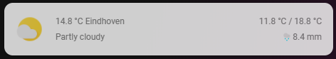

# Simple Weather Card



### Requirements (HACS)
| Name | Type  | Description |
|----------------------------------|-------------|---------------------------------------------------------------------------------------------------------------------------------------------------------------------------------------------------------|
| [Simple Weather Card](https://github.com/kalkih/simple-weather-card) | Frontend | This is a small weather card, see screenshot for details |

### Configuration
- To use this you can simply change the entity and the name (which is the city name)
- Experienced users can play with the styles or the backdrop if they want

### Install
- Create a new file in the view you want (e.g. /homekit-infused/user/views/frontpage/), you can name it however you want
- Copy the code below and make the necessary changes

```
- type: horizontal-stack
  cards:
    - !include ../../../base/includes/gap.yaml
    - type: custom:simple-weather-card                    
      style: |
        ha-card {
          border-radius: var(--border-radius);
          box-shadow: var(--box-shadow);
          opacity: 0.8;
          font-size: 12px;
          font-family: var(--font-family);
        }                      
      entity: weather.dark_sky
      name: Eindhoven
      backdrop: false
      tap_action:
        action: navigate
        navigation_path: /homekit-infused/weather
    - !include ../../../base/includes/gap.yaml
```

