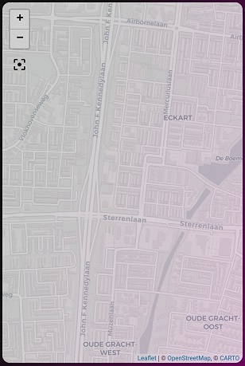

# Title Text Card



### Requirements (HACS)
| Name | Type  | Description |
|----------------------------------|-------------|---------------------------------------------------------------------------------------------------------------------------------------------------------------------------------------------------------|
| [NONE] | None | Not applicable |

### Configuration
- You can only change the name section of this card!

### Install
- Create a new file inside the folder of the view you want (e.g. /homekit-infused/user/views/location/), you can name the file however you want (e.g. title-text-card.yaml)
- Copy the code below and make changes if needed

```
- !include
  - '../../../base/templates/other/title-text.yaml'
  - name: Living Room
```

### Extra Information
This card is probably best used when placed inside a vertical-stack (this will avoid creating a separate file for just a title on each view), in this example I have merged this addon and another addon in single file.
```
- type: vertical-stack
  cards:
    - !include
      - '../../../base/templates/other/title-text.yaml'
      - name: Living Room
    - type: horizontal-stack
      cards:
        - type: entity-button
          entity: light.livingroom_lamp_1
        - type: entity-button
          entity: light.livingroom_lamp_2
        - type: entity-button
          entity: light.livingroom_lamp_3
```
Vertical stacks will render from top to bottom, horizontal-stacks from left to right. In this example the vertical-stack is the 'parent'. It will render the title-text-card as it's first card, the second card is a horizontal-stack (which has 3 buttons in it). Since the buttons are placed inside the horizontal-stack the buttons will be stacked next to each other horizontally.
