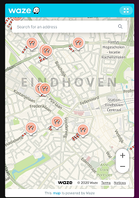

# Waze Card


### Description
This card will show you live traffic information on your current location (might not work nicely when on WiFi, this will depend on your ISP)

### Requirements (HACS)
| Name | Type  | Description |
|----------------------------------|-------------|---------------------------------------------------------------------------------------------------------------------------------------------------------------------------------------------------------|
| [NONE] | None | Not applicable |

### Configuration
- No configuration required!

### Install
- Create a new file inside the folder of the view you want (e.g. /homekit-infused/user/views/traffic/), you can name the file however you want (e.g. waze-card.yaml)
- Copy the code below and make changes if needed

```
- type: horizontal-stack
  cards:
    - !include ../../../base/includes/gap.yaml
    - type: iframe
      url: https://embed.waze.com/iframe
      aspect_ratio: 150%
    - !include ../../../base/includes/gap.yaml
```
